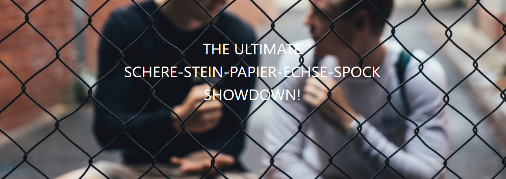

Dies ist der Lambda Layer Code für "THE ULTIMATE SCHERE-STEIN-PAPIER-ECHSE-SPOCK SHOWDOWN". Der Code wird vom "Serverless AWS Lambda und Alexa"-Workshop verwendet. 
Er dient als Beispiel für einen Lambda Layer.

# Umfang

Entgegen üblicher Best-Practice ist in diesem Codeteil der Lambda Layer und die API Implementierung enthalten

# Layer

Der Layer kann mittels `mvn install && serverless deploy` einfach in AWS deployt werden. Der 

# SSPES API

Die SSPES API kann lokal geclont werden und nach einem `mvn install` verwendet werden. Die Abhängigkeit muss in maven wie folgt
eingebunden werden:

```xml
        <dependency>
            <groupId>de.cweyermann.sspes</groupId>
            <artifactId>sspes-layer</artifactId>
            <version>1.0</version>
        </dependency>
```


Damit die API in AWS Lambda funktioniert werden DynamoDB Rechte benötigt. Diese können wie folgt in der `serverless.yaml`
vergeben werden:

```yaml
  iamRoleStatements:
    - Effect: 'Allow'
      Action:
        - cloudwatch:*
      Resource: "*"
    - Effect: 'Allow'
      Action:
        - dynamodb:*
      Resource: "arn:aws:dynamodb:eu-north-1:*:*"
```


Die Verwendung der API wird vollständig über die Klasse `SspesAPI` abgehandelt. Diese kann mit dem default 
Konstruktor initialisiert und direkt verwendet werden. Zum Beispiel wie folgt:

```java
SspesAPI api = new SspesAPI();
api.playUnrankedAgainstRandom("schere");
```

Die Verwendung der API beeinflust nicht das Ranking auf der SSPES Homepage.


